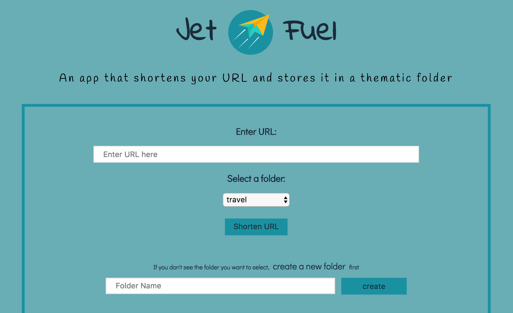

## Jet Fuel

Jet Fuel allows user to shorten a long URL and save it in a thematic folder. When user clicks on a shortened link, it redirects them to the original, long URL.
It is my first project in which I developed backend, using Node/Express with Knex and PostgreSQL databse.
Client-side code was written in jQuery.
Server-side is tested for all of the required endpoints, using mocha, chai and chai-http. The tests include both 'happy' and 'sad' paths.

#### Original Assignment: 
[Turing Project](http://frontend.turing.io/projects/jet-fuel.html)

#### Link to Deployed Application: 
[Heroku Link](https://justyna-jet-fuel.herokuapp.com)

